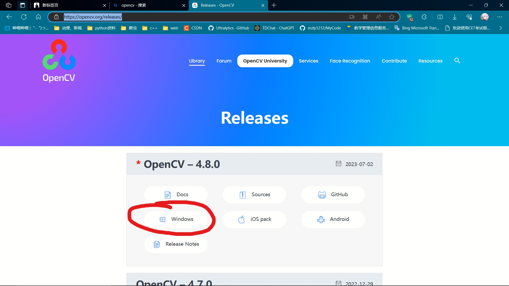

# 在vscode上使用cmake编译并部署opencv
参考文章：https://www.cnblogs.com/czlhxm/p/13848278.html
## 注意：CMakeLists.txt中 
set(OpenCV_DIR "path") path应为在opencv目录下build/x64目录新建d那个文件夹，
例如本次是：D:\\opencv\\build\\x64\\mingw

### 完整的测试用的CMakeLists.txt：
cmake_minimum_required(VERSION 3.27)
project(OpencvTest)
 
set(SOURCES opcv.cpp)
add_executable(${PROJECT_NAME} ${SOURCES})
 
set(OpenCV_DIR "D:\\opencv\\build\\x64\\mingw")
find_package(OpenCV REQUIRED)
if(OpenCV_FOUND)
    target_include_directories(${PROJECT_NAME} PUBLIC ${OpenCV_INCLUDE_DIRS})
    target_link_libraries(${PROJECT_NAME} ${OpenCV_LIBS})
 
endif()

## 之前一直出现的错误：
C:\Users\BIRIAL~1\AppData\Local\Temp\ccOicUUV.o: In function `main':
D:/CC++/opcv.cpp:6: undefined reference to `cv::imread(std::__cxx11::basic_string<char, std::char_traits<char>, std::allocator<char> > const&, int)'
D:/CC++/opcv.cpp:14: undefined reference to `cv::resize(cv::_InputArray const&, cv::_OutputArray const&, cv::Size_<int>, double, double, int)'    
D:/CC++/opcv.cpp:16: undefined reference to `cv::imshow(std::__cxx11::basic_string<char, std::char_traits<char>, std::allocator<char> > const&, cv::_InputArray const&)'
D:/CC++/opcv.cpp:18: undefined reference to `cv::waitKey(int)'
D:/CC++/opcv.cpp:6: undefined reference to `cv::Mat::~Mat()'
D:/CC++/opcv.cpp:6: undefined reference to `cv::Mat::~Mat()'
collect2.exe: error: ld returned 1 exit status

### 原因：编译程序时无法链接到相应的库上，执行g++ 时没有指定dll文件(不使用cmake的情况下)
 这是在cmake编译opencv时勾选了BUILD_opencv_world，所以只有一个dll，不勾选的话要向参考文章那样写一堆

## 下载opencv源码时，最好去官网下载exe文件运行(https://opencv.org/releases/)

## opencv_contrib 是opencv的一些额外拓展模块， 下载时应与opencv版本对应(全版本:https://github.com/opencv/opencv_contrib/tags)
下载解压，然后再cmake编译opencv时，将里面的modules的文件夹路径填入OPENCV_EXTRA_MODULES_PATH
