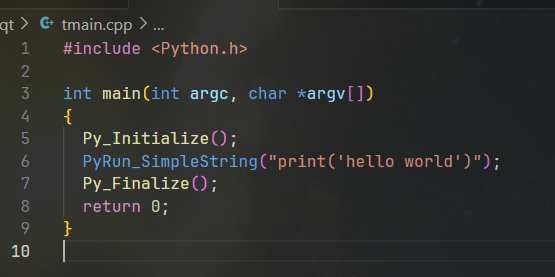
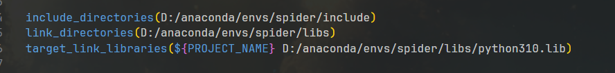
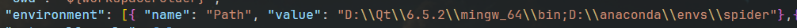
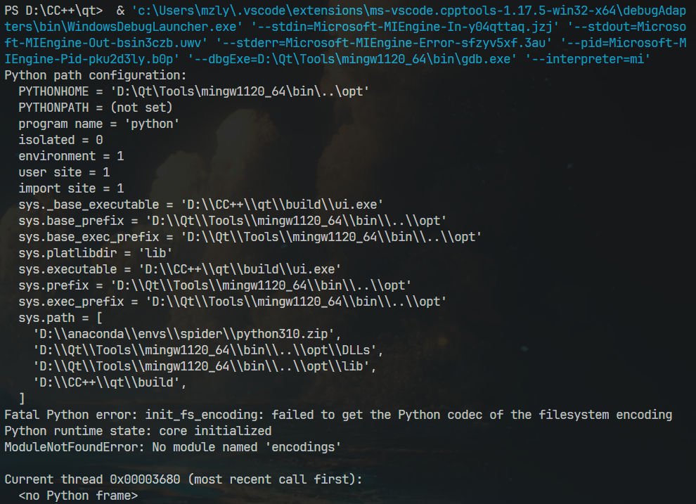

## 参考教程https://zhuanlan.zhihu.com/p/146874652

首先得包含python提供的C/C++接口Python.h,该文件位于python安装目录下的include文件夹(该文件夹提供许多包含文件)

## cmake配置：

### `include_directories()`添加包含文件的路径，怎样才能在源文件中`#include <Python.h>`
### `link_directories()` 它告诉CMake在链接项目的可执行文件或库时应该搜索哪些目录来查找依赖的库文件
### `target_link_libraries()` 链接python3.10的库文件，这里用绝对路径防止报错

## 记得将python路径添加到path环境变量中，否则调试时会报错，这里直接在launch.json文件中添加：

## 成功编译，但调试报错：

### 从报错信息可以看出PYTHONHOME路径是错的，因为我没有设置PYTHONHOME的路径，解决方法：环境变量中添加一下，如：

#### 参考文献：https://blog.csdn.net/big__banana/article/details/114228038