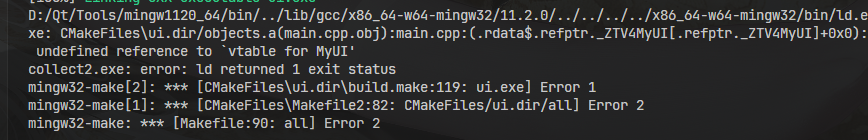
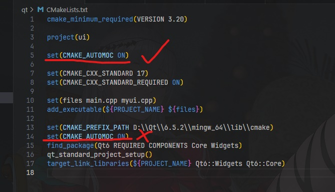

# 1.cmake 安装(https://blog.csdn.net/u011231598/article/details/80338941)
# 2.qt6下载安装(https://blog.csdn.net/weixin_57439178/article/details/129961918)
# 3.vscode cmake 配置qt6
## 3.1 cmake写法：
`set(CMAKE_PREFIX_PATH D:\\Qt\\6.5.2\\mingw_64\\lib\\cmake)
set(CMAKE_CXX_STANDARD 17)
set(CMAKE_CXX_STANDARD_REQUIRED ON)
find_package(Qt6 REQUIRED COMPONENTS Core Widgets)
qt_standard_project_setup()
target_link_libraries(${PROJECT_NAME} Qt6::Widgets Qt6::Core)`
## 3.2 程序编译后，vscode终端执行无反应，但去项目文件夹直接点开编译后的exe文件会显示缺少某些dll文件，这是因为缺少环境变量的原因
### 解决方法：
### 1.若要在window上执行则需要将保护那些dll文件的文件夹路径添加到系统path变量中
### 2.若想直接在vscode集成终端上运行，可以在launch.json文件中添加环境变量`"environment": [{"name":"Path","value":"D:\\Qt\\6.5.2\\mingw_64\\bin"}]`，这种方法会在集成终端调试程序时替换系统环境变量，也就是说不影响编译，要正常编译还是得将路径添加到系统的环境变量中(之前编译时终端不能识别mingw32-make.exe就是因为我以为这种方法也能影响编译时的环境变量而将系统环境变量中相关路径删除了)
## 3.3 源文件#include qt6相关文件时，c/c++红色波浪线报错，但是又可以正常编译调试，这是因为c_cpp_properties.json缺少`"configurationProvider": "ms-vscode.cmake-tools"`导致c/c++无法识别cmake添加的库
## 3.3 编写qt6程序时，需要信号与插槽，则需要在相关类中添加Q_OBJECT，并且在cmakelists.txt中加上`set(CMAKE_AUTOMOC ON)`,但是编译报错：

## 折腾了好久，最后发现是`set(CMAKE_AUTOMOC ON)`加错位置了，它应该在`add_executable()`之前，而不是之后

